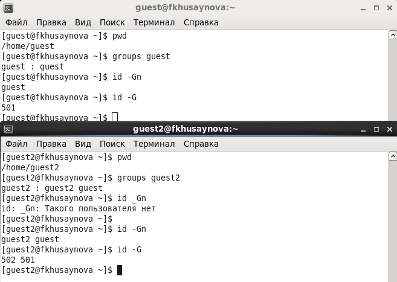
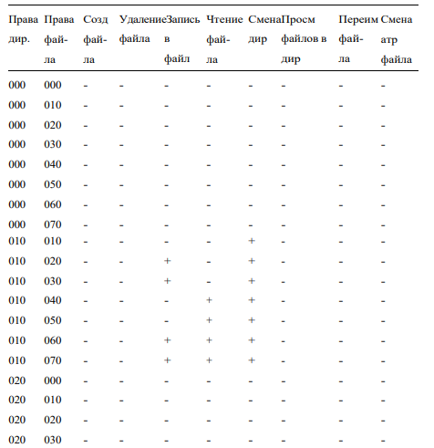
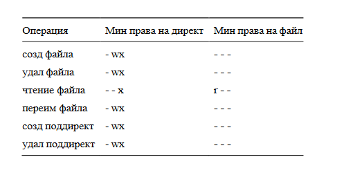

---
## Front matter
lang: ru-RU
title: Лабораторная работа №1 
author: |
	Хусайнова Фароиз Дилшодовна 
institute: |
	\inst{1}RUDN University, Moscow, Russian Federation
date: NEC--2021, 16 October, Moscow, Russian Federation

## Formatting
toc: false
slide_level: 2
theme: metropolis
header-includes: 
 - \metroset{progressbar=frametitle,sectionpage=progressbar,numbering=fraction}
 - '\makeatletter'
 - '\beamer@ignorenonframefalse'
 - '\makeatother'
aspectratio: 43
section-titles: truee
---

# Дискреционное разграничение прав в Linux. Два пользователя

## Цель выполнения лабораторной работы

- Получение практических навыков работы в консоли с атрибутами файлов для групп пользователей.

## Задачи выполнения работы

1. Создание учётной записи пользователя guest2
2. Выполнение базовых операций с директориями и файлами
3. Заполнение таблицы "Установленные права и разрешённые действия" опытным путем
4. Заполнение таблицы "Минимальные права для совершения операций" на основании заполненной таблицы 

## Выполнения лабораторной работы. Часть 1

Создала учётную запись пользователя guest2 (используя учётную запись администратора) (рис -@fig:001). 

{ #fig:001 width=70% }

Выполнила базовые операций с директориями и файлами (рис -@fig:002).

{ #fig:002 width=70% }

## Выполнения лабораторной работы. Часть 2

Таблицу 2.1

{ #fig:003 width=70% }

## Выполнения лабораторной работы. 

Таблица 2.2.

{ #fig:004 width=70% }

## Выводы

Получила практические навыки работы в консоли с атрибутами файлов для пользователей.
