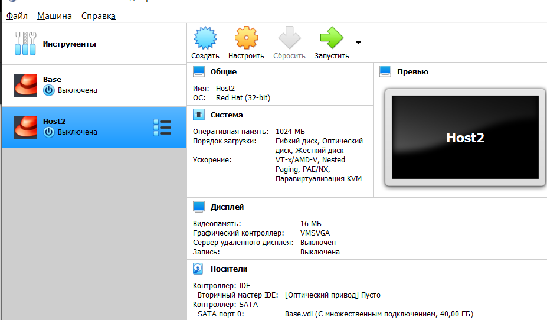

---
# Front matter
lang: ru-RU
title: "Лабораторная работа №1"
subtitle: "Установка и конфигурация операционной системы на виртуальную машину"
author: "Хусайнова Фароиз Дилшодовна"

# Formatting
toc-title: "Содержание"
toc: true # Table of contents
toc_depth: 2
lof: true # List of figures
lot: true # List of tables
fontsize: 12pt
linestretch: 1.5
papersize: a4paper
documentclass: scrreprt
polyglossia-lang: russian
polyglossia-otherlangs: english
mainfont: PT Serif
romanfont: PT Serif
sansfont: PT Sans
monofont: PT Mono
mainfontoptions: Ligatures=TeX
romanfontoptions: Ligatures=TeX
sansfontoptions: Ligatures=TeX,Scale=MatchLowercase
monofontoptions: Scale=MatchLowercase
indent: true
pdf-engine: lualatex
header-includes:
  - \linepenalty=10 # the penalty added to the badness of each line within a paragraph (no associated penalty node) Increasing the value makes tex try to have fewer lines in the paragraph.
  - \interlinepenalty=0 # value of the penalty (node) added after each line of a paragraph.
  - \hyphenpenalty=50 # the penalty for line breaking at an automatically inserted hyphen
  - \exhyphenpenalty=50 # the penalty for line breaking at an explicit hyphen
  - \binoppenalty=700 # the penalty for breaking a line at a binary operator
  - \relpenalty=500 # the penalty for breaking a line at a relation
  - \clubpenalty=150 # extra penalty for breaking after first line of a paragraph
  - \widowpenalty=150 # extra penalty for breaking before last line of a paragraph
  - \displaywidowpenalty=50 # extra penalty for breaking before last line before a display math
  - \brokenpenalty=100 # extra penalty for page breaking after a hyphenated line
  - \predisplaypenalty=10000 # penalty for breaking before a display
  - \postdisplaypenalty=0 # penalty for breaking after a display
  - \floatingpenalty = 20000 # penalty for splitting an insertion (can only be split footnote in standard LaTeX)
  - \raggedbottom # or \flushbottom
  - \usepackage{float} # keep figures where there are in the text
  - \floatplacement{figure}{H} # keep figures where there are in the text
---

# Цель работы

Приобретение практических навыков установки операционной системы на виртуальную машину, настройки минимально необходимых для дальнейшей работы сервисов.

# Задание

- Проверить настройки VirtualBox. 
- Создать новую вирутальную машину Base и запустить ее. 
- Провести конфигурацию вирутальной машины Base.
- Создать на основе виртуальной машины Base машину Host2.

# Выполнение лабораторной работы

  Для начало создаем каталог \textit{fkhusaynova} и переносим в него образ виртуальной машины \textit{CentOS-6.6-i386-minimal.iso} (рис -@fig:001)

{ #fig:001 width=70% }

Далее заупскаем ВМ и проверяем месторасположение каталога для виртуальных машин (рис -@fig:002).

{ #fig:002 width=70% }

Укажем имя виртуальной машины — Base, тип операционной системы — Linux, RedHat. (рис -@fig:003)

{ #fig:003 width=70% }

Укажем размер основной памяти виртуальной машины - 1024 МБ (рис -@fig:004)

{ #fig:004 width=70% }

Зададим конфигурацию жёсткого диска — загрузочный, VDI (BirtualBox Disk Image), динамический виртуальный диск (рис -@fig:05,рис -@fig:006, рис -@fig:007).

{ #fig:005 width=70% }

{ #fig:006 width=70% }

{ #fig:007 width=70% }

Зададим размер диска — 40 ГБ — и его расположение. (рис -@fig:008)

{ #fig:008 width=70% }

Выделяем в окне менеджера виртуальную машину , и открываем окно, чтобы  проверить, имеет ли путь папка для снимков виртуальной машины Base (рис -@fig:009)

{ #fig:009 width=70% }

Добавляем новый привод оптических дисков и выбераем образ \textit{CentOS-6.6-i386-minimal.iso} (рис -@fig:010, рис -@fig:011)

{ #fig:010 width=70% }

{ #fig:011 width=70% }

  Запустим виртуальную машину Base, выберем образ для установки системы. (рис -@fig:012)

{ #fig:012 width=70% }

Установим английский язык для интерфейса и раскладки клавиатуры (рис -@fig:013)

{ #fig:013 width=70% }

Указываем \textit{Стандартные накопители} (рис -@fig:014) для установки ОС. В окне конфигурации жёсткого диска выберем \textit{«Да, удалить данные»} (рис -@fig:015)

{ #fig:014 width=70% }

{ #fig:015 width=70% }

В качестве имени машины указываем (рис -@fig:016). Также указываем часовой пояс «Москва» (рис -@fig:017), и установим пароль для root (рис -@fig:018).

{ #fig:016 width=70% }

{ #fig:017 width=70% }

{ #fig:018 width=70% }

При конфигурировании размера жёсткого диска укажем \textit{«Всё пространство»} (рис -@fig:019).

{ #fig:019 width=70% }

Завершаем установку операционной системы и перезагружаем её.

{ #fig:020 width=70% }

На виртуальной машине Base запустим терминал, далее переходим под учетную запись \textit{root} с помощью команды \textit{su} (рис -@fig:021).

{ #fig:021 width=70% }

На основе виртуальной машины Base создадим машину Host2, выбрав при конфигурации виртуального жесткого диска «Использовать существующий жесткий диск»
Base.vdi (рис -@fig:022).

{ #fig:022 width=70% }

# Выводы

Приобрела практические навыки установки операционной системы на виртуальную машину, настройки минимально необходимых для дальнейшей работы сервисов.
