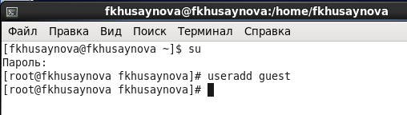
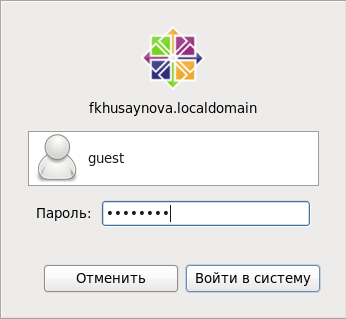
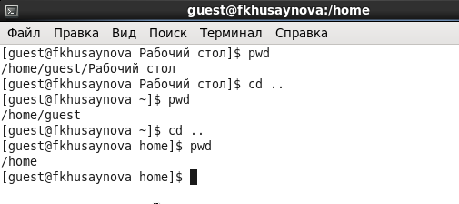
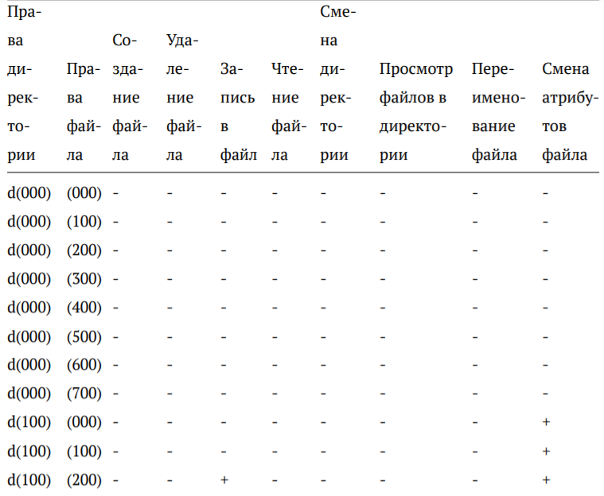
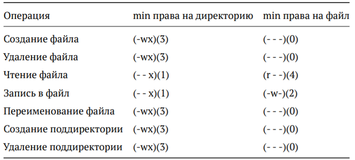

---
## Front matter
lang: ru-RU
title: Лабораторная работа №2 
author: |
	Хусайнова Фароиз Дилшодовна 
institute: |
	\inst{1}RUDN University, Moscow, Russian Federation
date: NEC--2021, 02 October, Moscow, Russian Federation

## Formatting
toc: false
slide_level: 2
theme: metropolis
header-includes: 
 - \metroset{progressbar=frametitle,sectionpage=progressbar,numbering=fraction}
 - '\makeatletter'
 - '\beamer@ignorenonframefalse'
 - '\makeatother'
aspectratio: 43
section-titles: truee
---

# Дискреционное разграничение прав в Linux. Основные атрибуты"

## Цель выполнения лабораторной работы

- Получение практических навыков работы в консоли с атрибутами файлов, закрепление теоретических основ дискреционного разграничения доступа в современных системах с открытым кодом на базе ОС Linux.

## Задачи выполнения работы

- Создать учетную запись пользователя guest (используя учетную запись администратора).
- Используя созданную учетную запись, войти в терминал и выполнить ряд действий. 
- Заполнить таблицу "Установленные права и разрешенные действия"
- Заполнить таблицу "Минимальные права для совершения операций"

## Выполнения лабораторной работы

- В установленной при выполнении предыдущей лабораторной работы операционной системе была создана учётная запись пользователя guest и также вход в нее 

{ #fig:001 width=70% }

##

- Вход в систему от имени пользователя guest

{ #fig:002 width=70% }

##

- Определение текущей директории. Переход в домашнюю директорию. Ниже приведены примеры команд, которые были использованы входе работы.

{ #fig:003 width=70% }

##

- Таблица "Установленные права и разрешенные действия" 

{ #fig:005 width=70% }

##

- Таблица "Минимальные права для совершения операций" 

{ #fig:006 width=70% }

##

- Таким образом, я получила практические навыки работы в консоли с атрибутами файлов, закрепила теоретические основы дискреционного разграничения доступа в современных системах с открытым кодом на базе ОС Linux.