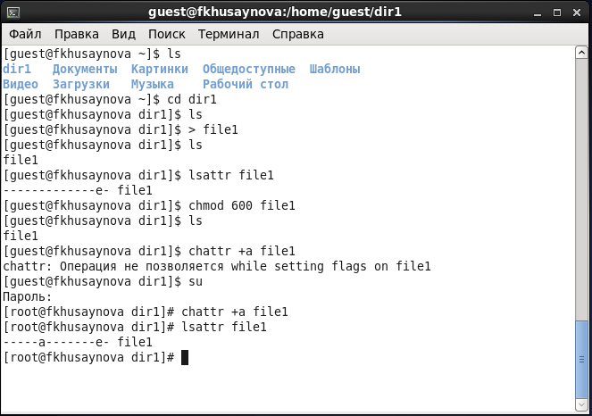
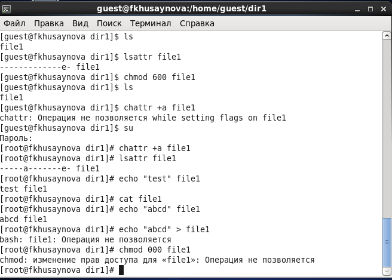
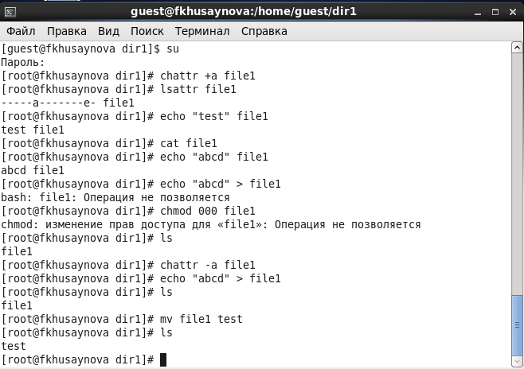
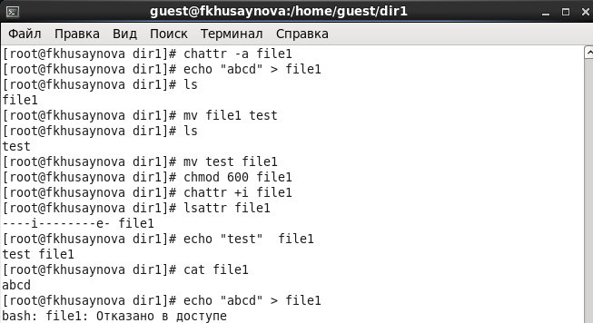
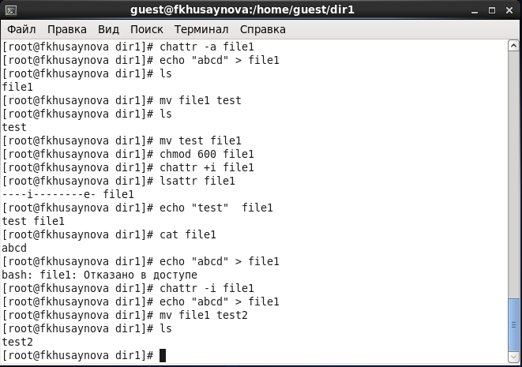

---
## Front matter
lang: ru-RU
title: Лабораторная работа №4
author: |
	Хусайнова Фароиз Дилшодовна - студентка группы НКНбд-01-18
date: 29.10.2021

## Formatting
toc: false
slide_level: 2
theme: metropolis
header-includes: 
 - \metroset{progressbar=frametitle,sectionpage=progressbar,numbering=fraction}
 - '\makeatletter'
 - '\beamer@ignorenonframefalse'
 - '\makeatother'
aspectratio: 43
section-titles: true
---

## Тема лабораторной работы

Дискреционное разграничение прав в Linux. Расширенные атрибуты

## Цель выполнения лабораторной работы

Получение практических навыков работы в консоли с расширенными атрибутами файлов.

## Задачи 

1. Создать от имени пользователя файл с расширенным атрибутом a и выполнить ряд операций
2. Заменить расширенный атрибут a на расширенный атрибут i и повторить все операции  

# Выполнения лабораторной работы

##

Установила расширенный атрибут a на файл.

{ #fig:001 width=50% }

##

Выполнила дозапись, чтение файла, перезапись и переименование файла.

{ #fig:002 width=50% }

## 

Снят расширенный атрибут a с файла.

{ #fig:003 width=50% }

##

Установила расширенный атрибут i на файл и  также выполнила дозапись, чтение файла, перезапись и переименование файла.

{ #fig:004 width=50% }

##

Сня расширенный атрибут i с файла и повторены операции, которые мне ранее не удавалось выполнить.

{ #fig:005 width=50% }

## Выводы

В процессе выполнения лабораторной работы получила практические навыки работы в консоли с расширенными атрибутами файлов, повысила свои навыки использования интерфейса командой строки (CLI), познакомилась на примерах с тем, как используются основные и расширенные атрибуты при разграничении доступа. Имела возможность связать теорию дискреционного разделения доступа (дискреционная политика безопасности) с её реализацией на практике в ОС Linux. Составила наглядные таблицы, поясняющие какие операции возможны при тех или иных установленных правах. Опробовала действие на практике расширенных атрибутов «а» и «i»

