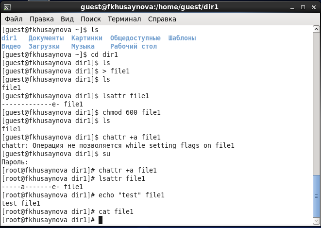
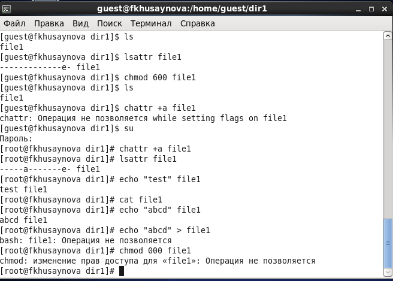
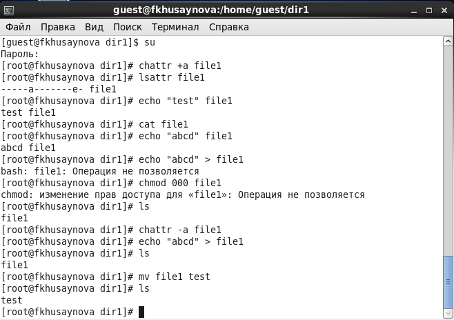
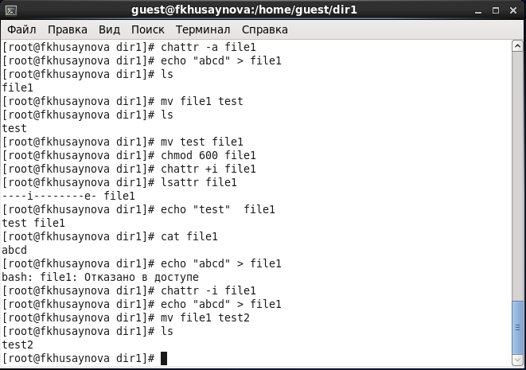

---
# Front matter
lang: ru-RU
title: "Лабораторная работа №4"
subtitle: "Дискреционное разграничение прав в Linux. Расширенные атрибуты"
author: "Хусайнова Фароиз Дилшодовна"

# Formatting
toc-title: "Содержание"
toc: true # Table of contents
toc_depth: 2
lof: true # List of figures
lot: true # List of tables
fontsize: 12pt
linestretch: 1.5
papersize: a4paper
documentclass: scrreprt
polyglossia-lang: russian
polyglossia-otherlangs: english
mainfont: PT Serif
romanfont: PT Serif
sansfont: PT Sans
monofont: PT Mono
mainfontoptions: Ligatures=TeX
romanfontoptions: Ligatures=TeX
sansfontoptions: Ligatures=TeX,Scale=MatchLowercase
monofontoptions: Scale=MatchLowercase
indent: true
pdf-engine: lualatex
header-includes:
  - \linepenalty=10 # the penalty added to the badness of each line within a paragraph (no associated penalty node) Increasing the value makes tex try to have fewer lines in the paragraph.
  - \interlinepenalty=0 # value of the penalty (node) added after each line of a paragraph.
  - \hyphenpenalty=50 # the penalty for line breaking at an automatically inserted hyphen
  - \exhyphenpenalty=50 # the penalty for line breaking at an explicit hyphen
  - \binoppenalty=700 # the penalty for breaking a line at a binary operator
  - \relpenalty=500 # the penalty for breaking a line at a relation
  - \clubpenalty=150 # extra penalty for breaking after first line of a paragraph
  - \widowpenalty=150 # extra penalty for breaking before last line of a paragraph
  - \displaywidowpenalty=50 # extra penalty for breaking before last line before a display math
  - \brokenpenalty=100 # extra penalty for page breaking after a hyphenated line
  - \predisplaypenalty=10000 # penalty for breaking before a display
  - \postdisplaypenalty=0 # penalty for breaking after a display
  - \floatingpenalty = 20000 # penalty for splitting an insertion (can only be split footnote in standard LaTeX)
  - \raggedbottom # or \flushbottom
  - \usepackage{float} # keep figures where there are in the text
  - \floatplacement{figure}{H} # keep figures where there are in the text
---

# Цель работы

Получение практических навыков работы в консоли с расширенными атрибутами файлов.

# Задание

1. Создать от имени пользователя файл с расширенным атрибутом a и выполнить ряд операций 
2. Заменить расширенный атрибут a на расширенный атрибут i и повторить все операции 

# Выполнение лабораторной работы

1. От имени пользователя guest определите расширенные атрибуты файла /home/guest/dir1/file1 командой lsattr /home/guest/dir1/file1 (рис -@fig:001).

{ #fig:001 width=70% }

Установила командой chmod 600 file1 на файл file1 права, разрешающие чтение и запись для владельца файла (рис -@fig:002).

{ #fig:002 width=70% }

Попробовала установить на файл /home/guest/dir1/file1 расширенный атрибут a от имени пользователя guest: chattr +a /home/guest/dir1/file1. В ответ я получила отказ от выполнения операции (рис -@fig:003).

{ #fig:003 width=70% }

Я повысила свои права с помощью команды su. Установила расширенный атрибут a на файл /home/guest/dir1/file1 от имени суперпользователя: chattr +a /home/guest/dir1/file1 (рис -@fig:004).

{ #fig:004 width=70% }

От пользователя guest проверила правильность установления атрибута: lsattr /home/guest/dir1/file1 (рис -@fig:005).

{ #fig:005 width=70% }

Выполнила дозапись в файл file1 слова «test» командой echo "test" /home/guest/dir1/file1. После этого выполнила чтение файла file1 командой cat /home/guest/dir1/file1. Слово test не было успешно записано в file1. (рис -@fig:006). 

{ #fig:006 width=70% }

Попробовала удалить файл file1 либо стереть имеющуюся в нём информацию командой echo "abcd" > /home/guest/dirl/file1. Не вышло.

Попробовала с помощью команды chmod 000 file1 установить на файл file1 права, например, запрещающие чтение и запись для владельца файла. Мне не удалось успешно выполнить указанные команды (рис -@fig:007).

{ #fig:007 width=70% }

Сняла расширенный атрибут a с файла /home/guest/dirl/file1 от имени суперпользователя командой chattr -a /home/guest/dir1/file1. Повторила операции, которые мне ранее не удавалось выполнить. Мне удалось дозаписать и перезаписать файл, переименование файла тоже прошло успешно (рис -@fig:008).

{ #fig:008 width=70% }

2. Теперь я повторю мои действия по шагам, заменив атрибут «a» атрибутом «i». 

Снова установила командой chmod 600 file1 на файл file1 права, разрешающие чтение и запись для владельца файла. Установила расширенный атрибут i на файл /home/guest/dir1/file1 от имени суперпользователя: chattr +i /home/guest/dir1/file1.
От пользователя guest проверила правильность установления атрибута: lsattr /home/guest/dir1/file1.

Далее выполнила дозапись в файл file1 слова «test» командой echo "test" /home/guest/dir1/file1. Попробовала удалить файл file1 либо стереть имеющуюся в нём информацию командой echo "abcd" > /home/guest/dirl/file1. Не вышло, мне было отказано в доступе (рис -@fig:008).

!Установка прав файла](images/9.PNG){ #fig:009 width=70% }

После сняла расширенный атрибут i с файла /home/guest/dirl/file1 от имени суперпользователя командой chattr -i /home/guest/dir1/file1 и повторила операции, которые мне ранее не удавалось выполнить(рис -@fig:009).

{ #fig:010 width=70% }

# Выводы

В процессе выполнения лабораторной работы получила практические навыки работы в консоли с расширенными атрибутами файлов.

